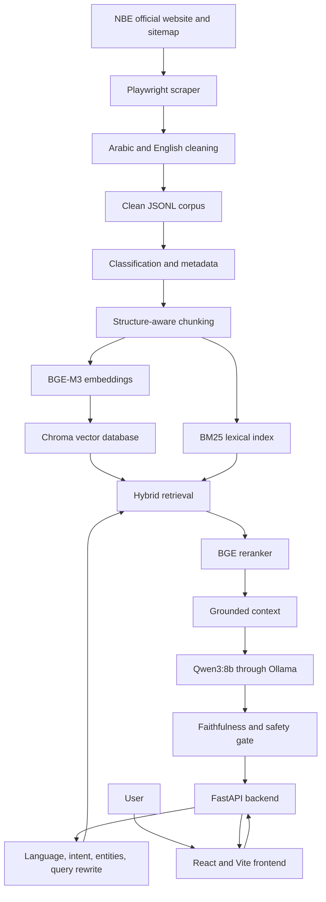

# NBE AI Search: Operations and Data Update Guide

This is the operating runbook for the bilingual NBE AI Search application. It explains the architecture, where data is stored, how the pipeline works from scraping to answers, how to refresh one changed page or date-sensitive information, how to run the application, and how to validate and roll back updates.

## 1. Current snapshot

Snapshot date: **2026-08-20**.

- Scraped and cleaned pages: **688**
- Arabic pages: **347**
- English pages: **341**
- Effective documents after duplicate filtering and curated merging: **557**
- Indexed chunks: **810**
- Vector collection: `nbe_chunks_bge_m3_v7`
- Semantic cache collection: `nbe_semantic_cache_v8`
- Local LLM: `qwen3:8b`
- Embeddings: `BAAI/bge-m3`
- Reranker: `BAAI/bge-reranker-v2-m3`

These counts are a dated snapshot. They may change after a new crawl or quality-rule change.

## 2. Architecture

The application is an on-premise, bilingual, hybrid Retrieval-Augmented Generation (RAG) system.



A search request passes through:

1. language and intent detection;
2. query rewriting and entity extraction;
3. BGE-M3 dense retrieval from Chroma;
4. BM25 keyword retrieval;
5. rank fusion and soft business-rule boosts;
6. cross-encoder reranking;
7. grounded context construction with official URLs;
8. Qwen answer generation; and
9. faithfulness evaluation, citation output, or abstention.

## 3. Files and storage

| Purpose | Location |
|---|---|
| Repository | `/home/jovyan/search/SmartBankSearch` |
| Backend | `nbe-ai-search-mvp/` |
| Frontend | `nbe-ai-search-mvp/frontend/ai-search-toggle/` |
| Scraper | `rescrape_playwright.py` |
| Scraper requirements | `scrape-requirements.txt` |
| Clean bilingual corpus | `nbe-scrape-cleaner/output/documents.jsonl` |
| Scrape report | `nbe-scrape-cleaner/output/rescrape_report.md` |
| Reviewed fallback data | `nbe-ai-search-mvp/data/curated_documents.json` |
| Chroma storage | `nbe-ai-search-mvp/data/chroma/` |
| BM25 index | `nbe-ai-search-mvp/data/bm25/corpus.pkl` |
| Backend settings | `nbe-ai-search-mvp/shared/config.py` and `.env` |
| Ingestion command | `nbe-ai-search-mvp/scripts/run_ingest.py` |

`documents.jsonl` is the cleaned, human-inspectable corpus. Chroma and BM25 are generated indexes. Never edit Chroma or the BM25 pickle directly.

## 4. Data contract

Every searchable document requires:

```json
{
  "id": "AR_Product_Unique_ID",
  "title": "اسم المنتج",
  "url": "https://www.nbe.com.eg/NBE/E/#/AR/...",
  "language": "ar",
  "content": "Complete and accurate page content longer than 120 characters.",
  "metadata": {}
}
```

Rules:

- Use a unique, stable `id`.
- Keep the same ID and URL when updating an existing document.
- `language` must be `ar` or `en`.
- Arabic and English versions are separate documents.
- Use the authoritative source URL.
- Cleaned JSONL content shorter than 120 characters is rejected.
- A record with `metadata.duplicate_of` is skipped.
- Never include customer data, passwords, tokens, API keys, or other secrets.

## 5. First-time installation

### Backend and scraper

```bash
cd /home/jovyan/search/SmartBankSearch/nbe-ai-search-mvp
python -m venv .venv
.venv/bin/pip install -r requirements.txt
.venv/bin/pip install -r ../scrape-requirements.txt
```

The scraper currently defaults to Google Chrome at `/usr/bin/google-chrome`. If it is installed elsewhere, pass `--executable-path`.

### Frontend

```bash
cd /home/jovyan/search/SmartBankSearch/nbe-ai-search-mvp/frontend/ai-search-toggle
npm install
```

### Ollama

```bash
ollama list
ollama pull qwen3:8b  # only if it is missing
```

Recommended `.env` values for the current machine:

```dotenv
OLLAMA_BASE_URL=http://localhost:11434
OLLAMA_MODEL=qwen3:8b
LLM_TIER2_ENABLED=false
EMBEDDING_MODEL=BAAI/bge-m3
RERANKER_MODEL=BAAI/bge-reranker-v2-m3
CHROMA_COLLECTION=nbe_chunks_bge_m3_v7
SEMANTIC_CACHE_COLLECTION=nbe_semantic_cache_v8
CORS_ORIGINS=http://localhost:5173,http://localhost:3000
```

Only set `LLM_TIER2_ENABLED=true` after installing the configured Tier-2 model. Environment variables override defaults in `shared/config.py`; make sure an old `.env` does not select an older collection.

## 6. Run the application

Use three terminals.

### Terminal 1: Ollama

```bash
ollama serve
```

Ollama listens on `http://127.0.0.1:11434`.

### Terminal 2: Backend

```bash
cd /home/jovyan/search/SmartBankSearch/nbe-ai-search-mvp
PYTHONPATH=. .venv/bin/uvicorn services.api.main:app --host 0.0.0.0 --port 7000
```

- API: `http://localhost:7000`
- API docs: `http://localhost:7000/docs`
- Health: `http://localhost:7000/v1/health`
- Metrics: `http://localhost:7000/metrics`

### Terminal 3: Frontend

```bash
cd /home/jovyan/search/SmartBankSearch/nbe-ai-search-mvp/frontend/ai-search-toggle
npm run dev -- --host 0.0.0.0
```

Open `http://localhost:5173`.

The Vite development server proxies `/v1` to `http://127.0.0.1:7000`. For separate production origins, build with the correct `VITE_API_BASE` and configure backend CORS.

## 7. Health and GPU verification

```bash
curl -fsS -o /dev/null -w 'frontend=%{http_code}\n' http://127.0.0.1:5173/
curl -fsS http://127.0.0.1:7000/v1/health
```

Expected backend result:

```json
{"status":"ok","components":{"vector_db":"ok","llm":"ok","api":"ok"}}
```

Run a search:

```bash
curl --json '{
  "query": "ما هي شهادات البنك الأهلي المصري؟",
  "language": "ar",
  "debug": true
}' http://127.0.0.1:7000/v1/search
```

Then inspect GPU use:

```bash
ollama ps
nvidia-smi
```

After a generated query, `ollama ps` should show `qwen3:8b` using GPU. `ollama list` confirms whether the model exists on disk even when it is no longer loaded in memory.

## 8. End-to-end data pipeline

### Stage A: Discover

The scraper reads the official NBE sitemap and accepts only validated NBE Arabic and English URLs. It rejects malformed, concatenated, placeholder, test, and non-NBE routes.

### Stage B: Render and scrape

Playwright opens each page in Chrome, waits for the JavaScript SPA to render and the DOM to settle, and extracts visible headings, text, and tables. Images, media, fonts, chat, analytics, and unnecessary network traffic are blocked.

### Stage C: Clean and validate

The cleaner removes menus, navigation, repeated cross-page boilerplate, placeholders, and unusable content. It applies minimum-content and language-quality gates and flags exact-content duplicates.

### Stage D: Store

Valid pages are atomically written to:

```text
nbe-scrape-cleaner/output/documents.jsonl
```

A quality report is written to:

```text
nbe-scrape-cleaner/output/rescrape_report.md
```

### Stage E: Enrich and chunk

Ingestion merges real scraped pages with approved curated fallbacks, classifies categories and document types, normalizes Arabic and English, and splits documents into overlapping searchable chunks.

### Stage F: Index

BGE-M3 creates embeddings for new or changed chunks. Chroma stores dense vectors and metadata. BM25 is rebuilt for keyword search. Chunk content hashes make ingestion idempotent.

### Stage G: Search and answer

The backend retrieves, fuses, reranks, builds grounded context, generates through Qwen, evaluates support, and returns citations or abstains.

## 9. Full website refresh

Use this when several pages changed or new pages were added.

### 1. Preserve the last known-good version

Make sure the current corpus is committed before replacing it. The scraper writes the output atomically, but Git history is still the operational rollback.

### 2. Run the bilingual scrape

```bash
cd /home/jovyan/search/SmartBankSearch

nbe-ai-search-mvp/.venv/bin/python rescrape_playwright.py \
  --languages ar,en \
  --concurrency 2 \
  --delay 1 \
  --retries 1
```

Do not set the delay below `0.5` seconds or bypass the concurrency cap. The scraper accesses NBE production systems.

### 3. Review quality

```bash
less nbe-scrape-cleaner/output/rescrape_report.md
```

Block ingestion if there is an unexplained large change in document count, language balance, categories, failures, duplicates, or URL validity.

### 4. Ingest

```bash
cd /home/jovyan/search/SmartBankSearch/nbe-ai-search-mvp
PYTHONPATH=. .venv/bin/python scripts/run_ingest.py --source merged
```

Only accept `status=completed`. A successful unlimited run updates changed chunks, rebuilds BM25, and removes stale chunks. A failed run does not prune stale chunks.

### 5. Invalidate cache, restart, and test

When ingestion runs through the CLI, restart the backend so its in-memory BM25 index reloads. Invalidate the semantic answer cache and test changed topics in Arabic and English.

## 10. Update one changed page

Examples: a product description, eligibility condition, fee, rate, working time, or application procedure.

### Safest supported workflow today

1. Record the exact official URL.
2. Verify the change and its effective date.
3. Record the matching Arabic or English URL; update both languages when available.
4. Run the full bilingual scrape.
5. Review the report and Git diff.
6. Run full merged ingestion without `--limit`.
7. Invalidate the semantic cache.
8. Restart the backend.
9. Ask targeted questions and confirm the changed URL is cited.

Unchanged chunks are skipped; changed chunk hashes cause re-embedding.

### `--urls-file` limitation

The current `--urls-file` option adds URLs to the sitemap set. It does **not** mean “scrape only these URLs.” It still crawls the accepted sitemap.

Do not run an experimental one-page scrape directly into the main `documents.jsonl` unless it safely preserves and merges the complete corpus. The writer replaces its target atomically.

For frequent targeted updates, add a dedicated `update_page.py` tool that:

1. accepts one validated NBE URL;
2. scrapes into staging;
3. applies the same cleaning and language gates;
4. matches the existing record by canonical URL;
5. preserves its stable ID;
6. replaces only that record atomically;
7. validates the complete JSONL corpus;
8. runs ingestion; and
9. invalidates cached answers associated with that URL.

Until that tool is implemented, a full refresh is slower but safer.

### Emergency manual correction

Use only for an approved urgent correction:

- Edit exactly one JSON object with a JSON-aware tool.
- Preserve `id`, `url`, and `language`.
- Update actual `content`, not metadata alone.
- Validate every JSONL line.
- Run full merged ingestion without `--limit`.
- Invalidate cache, restart, test, and record the official evidence.
- Replace the manual correction with a reproducible scrape later.

## 11. Update a date, rate, fee, or time-sensitive value

### Value changed on the NBE website

1. Verify the new value and effective date on the official page.
2. Check both Arabic and English pages.
3. Run a fresh scrape.
4. Confirm the new value exists in `documents.jsonl`.
5. Confirm the old value is gone from that document.
6. Run full merged ingestion.
7. Version or disable the old semantic cache.
8. Restart the backend.
9. Ask a direct question and inspect answer, confidence, faithfulness, and citation.

Changing only `reviewed_at`, `extracted_at`, or another metadata date does not change search answers. The searchable `content` must contain the new value.

### Curated value

For a reviewed document in `data/curated_documents.json`, update:

- `content`;
- `curated_version`;
- `reviewed_at`;
- `valid_until`; and
- relevant category or product metadata.

It must keep `status: "approved"`. Expired curated documents are excluded automatically. Use short validity for rates and other volatile financial data.

### Suggested frequency

- Exchange rates: use an official API or high-frequency scheduled feed if available.
- Certificate/deposit rates: check daily and after official announcements.
- Fees and terms: daily or weekly change detection.
- Branch hours: daily around holidays and official changes.
- General products: weekly crawl plus event-driven updates.

The current application uses batch ingestion, not a real-time stream.

## 12. Add approved manual or external data

Approved fallback documents live in:

```text
nbe-ai-search-mvp/data/curated_documents.json
```

Example:

```json
{
  "id": "AR_New_Product_20260820",
  "title": "اسم المنتج الجديد",
  "url": "https://www.nbe.com.eg/NBE/E/#/AR/ProductDetails?...",
  "language": "ar",
  "content": "المعلومات الكاملة والدقيقة عن المنتج وشروطه ورسومه وطريقة التقديم.",
  "metadata": {
    "source": "curated_document",
    "is_stub": false,
    "curated_version": "2026-08-20.1",
    "reviewed_at": "2026-08-20",
    "valid_until": "2026-09-20",
    "status": "approved",
    "doc_type": "product",
    "category": "products"
  }
}
```

Required curated metadata:

- `source: curated_document`
- `is_stub`
- `curated_version`
- `reviewed_at`
- `valid_until`
- `status: approved`

A real scraped document wins when it has the same canonical URL as a curated fallback. Curated records fill missing coverage; they do not silently override official scraped pages.

Convert CSV, Excel, database, PDF, or API input into the same document contract using a source adapter. Do not feed raw records directly to Qwen.

## 13. Ingestion behavior

Normal command:

```bash
PYTHONPATH=. .venv/bin/python scripts/run_ingest.py --source merged
```

It:

1. loads cleaned JSONL;
2. loads supported staged pages;
3. merges approved curated fallbacks by canonical URL;
4. classifies and normalizes documents;
5. creates overlapping chunks;
6. computes deterministic chunk hashes;
7. skips unchanged chunks;
8. embeds and upserts changed chunks;
9. rebuilds BM25; and
10. prunes stale chunks only after a fully successful unlimited run.

Supported sources are `documents_json`, `scrape`, `cleaned_jsonl`, and `merged`. Use `merged` for production.

Do not use `--limit` for a production update. It is only for diagnostics and does not prune stale chunks.

`POST /v1/admin/ingest` also exists, but it is synchronous and unauthenticated in this MVP. Do not expose it publicly. Use the CLI or a protected background job in production.

## 14. Semantic cache after updates

The semantic cache can return an old answer for up to 24 hours. Updating Chroma does not automatically invalidate every cached answer.

For an immediate release:

1. change `SEMANTIC_CACHE_COLLECTION`, for example from `nbe_semantic_cache_v8` to `nbe_semantic_cache_v9`, then restart; or
2. set `SEMANTIC_CACHE_ENABLED=false`, restart and validate, then enable a fresh versioned cache.

Versioning is safer than manually deleting broad Chroma storage.

## 15. Routine update versus migration

### Routine content update

Keep `CHROMA_COLLECTION=nbe_chunks_bge_m3_v7`. Hash-based upserts update only changed chunks.

### Major indexing change

Use a new collection when changing the embedding model, chunk size/overlap, chunk ID algorithm, retrieval metadata schema, or most cleaning rules.

Blue-green procedure:

1. choose a new collection, such as `nbe_chunks_bge_m3_v8`;
2. set `CHROMA_COLLECTION` in the ingestion environment;
3. run full merged ingestion;
4. verify counts and golden queries;
5. restart the backend with the same collection; and
6. retain the previous collection temporarily for rollback.

A routine content update needs no SQL-style migration.

## 16. Validation

### Validate JSONL

```bash
cd /home/jovyan/search/SmartBankSearch
nbe-ai-search-mvp/.venv/bin/python - <<'PY'
import json
from pathlib import Path

path = Path("nbe-scrape-cleaner/output/documents.jsonl")
required = {"id", "title", "url", "language", "content"}
count, ids, languages = 0, set(), {}
for number, line in enumerate(path.open(encoding="utf-8"), 1):
    row = json.loads(line)
    missing = required - row.keys()
    if missing:
        raise SystemExit(f"line {number}: missing {sorted(missing)}")
    if row["id"] in ids:
        raise SystemExit(f"line {number}: duplicate id {row['id']}")
    if row["language"] not in {"ar", "en"}:
        raise SystemExit(f"line {number}: invalid language")
    if len(row["content"].strip()) < 120:
        raise SystemExit(f"line {number}: content too short")
    ids.add(row["id"])
    languages[row["language"]] = languages.get(row["language"], 0) + 1
    count += 1
print({"documents": count, "languages": languages})
PY
```

### Unit tests

```bash
cd /home/jovyan/search/SmartBankSearch/nbe-ai-search-mvp
PYTHONPATH=. .venv/bin/pytest tests/unit -q
```

### Frontend build

```bash
cd /home/jovyan/search/SmartBankSearch/nbe-ai-search-mvp/frontend/ai-search-toggle
npm run build
```

### Acceptance search set

Test Arabic and English for certificates/rates, loans, cards, accounts, wallets, branches/ATMs, an unsupported question, and every changed product.

Confirm:

- `answered` is appropriate;
- the new value is present and the old value absent;
- citations are official and relevant;
- `faithfulness` is supported for answered queries; and
- latency is measured.

A “nearest branch” query must obtain the user's city or location before claiming that a specific branch is nearest.

## 17. Commit and push approved data

```bash
cd /home/jovyan/search/SmartBankSearch

git status --short
git diff --check
git add nbe-scrape-cleaner/output/documents.jsonl \
        nbe-scrape-cleaner/output/rescrape_report.md
git commit -m "data: refresh bilingual NBE corpus"
git push
```

Review the diff before committing. Only public, approved NBE content belongs in the repository.

## 18. Rollback

Prefer a new revert commit instead of rewriting shared history:

```bash
git log --oneline -- nbe-scrape-cleaner/output/documents.jsonl
git revert <bad-data-commit>
```

Then run full merged ingestion, version the cache, restart, and retest.

For a failed blue-green index migration, restart with the previous `CHROMA_COLLECTION` and matching BM25 index. Never broadly delete the repository, Chroma directory, or workspace root.

## 19. Recommended production automation

```text
Schedule or approved change event
  -> scrape into staging
  -> schema, URL, language, and content gates
  -> diff against current corpus
  -> human approval for financial values and legal terms
  -> build/update search indexes
  -> automated retrieval and answer evaluations
  -> switch to the approved collection
  -> invalidate semantic cache
  -> health and smoke tests
  -> publish report and alert on failure
```

Production controls:

- Store every run ID, source time, counts, and errors.
- Alert on unexplained document-count or language-balance changes.
- Require approval for rates, fees, eligibility, and legal terms.
- Keep the last known-good corpus and collection.
- Protect admin endpoints with authentication and authorization.
- Use containers or a process manager, TLS, and a reverse proxy.
- Never expose Ollama or Chroma directly to the internet.
- Monitor latency, GPU memory, abstention, unsupported answers, and scrape failures.

## 20. Troubleshooting

### Qwen is missing

```bash
ollama list
ollama pull qwen3:8b
```

### Ollama is down

```bash
ollama serve
curl http://127.0.0.1:11434/api/tags
```

### JSONL is updated but search returns old content

Check:

1. ingestion ended with `status=completed`;
2. ingestion and backend use the same `CHROMA_COLLECTION`;
3. the backend restarted after CLI ingestion;
4. semantic cache was versioned or disabled;
5. the document is not marked duplicate;
6. content is longer than 120 characters; and
7. the query cites the expected URL.

### Scraper returns a thin page

The page may require a page-specific wait, tab, or accordion interaction. Do not accept a navigation-only SPA shell. Record it in the report and add a page-specific extraction rule.

### First response is slow

Cold startup loads BGE-M3, the reranker, and Qwen into GPU memory. Keep models warm in production, disable unavailable Tier-2 models, and measure retrieval, reranking, generation, and self-evaluation separately.

### GPU is not used

```bash
nvidia-smi
ollama ps
```

Confirm NVIDIA drivers, CUDA access, and the NVIDIA Container Toolkit when using Docker.

## 21. Quick update checklist

- [ ] Verify the change on the official source.
- [ ] Record exact Arabic and English URLs.
- [ ] Update both languages when available.
- [ ] Run a complete, respectful scrape.
- [ ] Review the report and corpus diff.
- [ ] Run full `--source merged` ingestion without `--limit`.
- [ ] Confirm `status=completed` and sensible counts.
- [ ] Version or disable semantic cache.
- [ ] Restart the backend after CLI ingestion.
- [ ] Run Arabic and English acceptance searches.
- [ ] Check citations, faithfulness, and effective date.
- [ ] Run unit tests and frontend build.
- [ ] Commit and push approved data and report.
- [ ] Keep the previous version for rollback.
