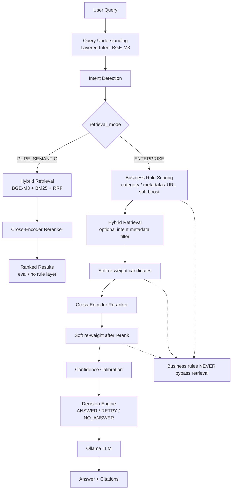

# Soft-Boost Retrieval Architecture

## Principle

**Business Rules are an Enterprise Banking Safety Layer — not an AI retrieval mechanism.**

Semantic retrieval (BGE-M3 + BM25 + RRF + BGE-Reranker-v2-m3) remains independently measurable via `PURE_SEMANTIC` mode. Enterprise rules only improve precision for high-value banking intents through **score multipliers on already-retrieved candidates**. They **never** inject or pin a document outside the retriever’s candidate set.

## Target pipeline

## Modes

| Mode | Business rules | Intent metadata filter | Confidence gate | Use |
|------|----------------|------------------------|-----------------|-----|
| `PURE_SEMANTIC` | Off | Off | Off (return ranked chunks) | Evaluation of true semantic retrieval |
| `ENTERPRISE` | Soft boost (`score *= business_weight`) | On when intent confidence high | On | Production banking |

Independent flag: `business_rules_enabled` (default `True`). In `PURE_SEMANTIC`, rules are always inactive.

## Soft boost signals

`business_weight` combines (scaled by intent confidence):

- preferred categories (`exchange`, `currency`, `forex`, …)
- metadata / `doc_type` alignment
- soft URL marker similarity (preference only)
- product / `page_type` alignment
- mismatch penalties (never absolute filters)

## Deprecated behavior

| Old | New |
|-----|-----|
| `force_canonical_inject=True` + score `0.99` pin | Soft multiplicative boost among retrieved candidates |
| `RetrievalDecision.FORCE_CANONICAL` pin | `RETRY_RELATED` / `NO_ANSWER` (enum value kept, never emitted for inject) |
| Exact URL substring as hard path | Preferred categories → metadata weighting → reranker |
