# NBE Enterprise AI Search Platform
## Implementation Plan & Enterprise Architecture Document

> **Active docs (read these first):**  
> - Model stack decisions: [`docs/enterprise-model-decisions.md`](docs/enterprise-model-decisions.md)  
> - Phases 1–4 delivery plan: [`docs/plan-enterprise-ai-search.md`](docs/plan-enterprise-ai-search.md)  
> - Retrieval quality redesign: [`docs/plan-retrieval-redesign.md`](docs/plan-retrieval-redesign.md)  
>  
> This document remains the broader platform architecture roadmap.

**Document Classification:** Internal / Confidential
**Version:** 1.1
**Prepared for:** CTO Office, Enterprise Architecture Board, National Bank of Egypt
**Document Type:** Production Implementation Plan (Not a Prototype)

---

## Table of Contents

1. Executive Summary
2. Business Problem
3. Proposed Solution
4. Functional Requirements
5. Non-Functional Requirements
6. High-Level Architecture
7. Detailed Architecture
8. AI Architecture
9. Data Flow
10. Knowledge Connector Framework
11. Incremental Synchronization Strategy
12. Security Architecture
13. Deployment Architecture
14. On-Prem Infrastructure
15. Technology Stack
16. Folder Structure
17. Development Roadmap
18. Milestones
19. Risks
20. Future Enhancements
21. Sequence Diagrams
22. Mermaid Diagrams (Consolidated Index)
23. Component Diagrams
24. Deployment Diagram
25. Class Diagram
26. APIs
27. Database Design
28. Vector Database Design
29. Performance Optimization
30. Enterprise Best Practices
31. DevOps Pipeline
32. Monitoring Strategy
33. Testing Strategy
34. Acceptance Criteria
35. Architecture Decision Records (ADR)
36. Final Implementation Roadmap

---

## 1. Executive Summary

The National Bank of Egypt (NBE) Enterprise AI Search Platform is a fully on-premises, production-grade semantic search system that augments — rather than replaces — the existing NBE website search. It is delivered as an independent microservice platform, exposed to the website as an optional "AI Search Mode" toggle, in the pattern of Google AI Mode or Microsoft Copilot Search.

The platform is built on Retrieval-Augmented Generation (RAG) principles with one critical architectural refinement over a naive RAG design: **live, time-sensitive banking data (exchange rates, branch/ATM status, fee schedules) is never embedded into the vector store**. Instead, it is served through a **structured tool-calling path** that queries live internal systems directly, while narrative/static content (products, FAQs, policies, news, HSE and compliance documents) is served through the semantic RAG path. This dual-path design is the single most important decision in this document, because it is what prevents the system from confidently presenting stale or hallucinated financial figures to customers — an unacceptable failure mode for a bank.

The platform is designed around a pluggable **Knowledge Connector Framework**, so that new data sources (CMS, product catalogs, branch directories, PDFs) can be onboarded without modifying the core AI Search engine. Incremental synchronization ensures the vector database and live-data caches are updated continuously without full reindexing or LLM retraining.

Everything — embedding models, LLMs, vector database, orchestration layer, and caches — runs inside NBE's own infrastructure. No customer data, query, or document ever leaves the bank's network boundary. No cloud AI APIs (OpenAI, Anthropic, Google, etc.) are used at runtime.

This document is the implementation-ready architecture and delivery plan for Enterprise Architecture Board approval, technical design authority sign-off, and program execution planning.

---

## 2. Business Problem

NBE's public website search is keyword-based (likely a traditional inverted-index search, e.g., Elasticsearch/Solr-style exact or fuzzy term matching). This creates friction for customers:

- **Vocabulary mismatch**: Customers ask natural questions ("عايز أعرف عمولة التحويل من مصر للسعودية") that don't match the exact terms used in product pages.
- **No synthesis**: Keyword search returns a list of pages; it cannot synthesize an answer across multiple pages (e.g., comparing two savings certificates).
- **No grounding for conversational use**: As customer expectations shift toward conversational, AI-mode search (driven by Google/Microsoft consumer experiences), a bank offering only keyword search increasingly feels dated and harder to use for non-technical customers, especially older demographics and Arabic-first speakers.
- **Bilingual gap**: Arabic (including Egyptian colloquial phrasing) query understanding is weak in traditional keyword engines tuned primarily for exact-match Arabic or English tokens.
- **No trust layer**: Even where fuzzy/semantic plugins exist for keyword engines, there is no answer synthesis with citations — customers must read multiple pages themselves.

At the same time, NBE operates under strict regulatory, data-residency, and security constraints (Central Bank of Egypt regulations, data sovereignty, zero customer-data-leakage requirements) that rule out SaaS/cloud AI search products and public LLM APIs entirely. This mandates a fully on-premises AI stack — a materially different (and harder) engineering problem than adopting a commercial cloud AI search product.

---

## 3. Proposed Solution

An independent, on-premises **AI Search Platform** deployed alongside (not inside) the existing website stack, integrated only via a thin API/widget layer:

- **Non-invasive integration**: The existing website and its keyword search are untouched. The AI Search Platform exposes a REST/gRPC API and a lightweight embeddable widget; the website adds an "AI Search Mode" toggle that calls this new API.
- **Dual-path retrieval architecture**:
  - **RAG path** for static/narrative content (products, FAQs, news, policies, HSE/compliance documents) — embeddings, vector search, reranking, grounded LLM synthesis with citations.
  - **Tool-calling path** for live/structured data (exchange rates, branch/ATM lookup, fee tables) — the LLM performs NLU and calls a scoped internal read API directly; no embedding staleness risk.
- **Pluggable Knowledge Connector Framework**: each data source (Website, CMS, Product, FAQ, Branch, ATM, Exchange Rate, News, PDF) implements a standard interface and emits a standardized "Knowledge Document" or "Live Data Entity" — the AI engine never has source-specific logic.
- **Incremental synchronization**, prioritized: Webhook → CMS API → Internal REST APIs → Database Connector (via mediating read API only) → Incremental crawl fallback.
- **Tiered local LLM strategy**: a small, fast, quantized multilingual model handles the majority of grounded lookups; a larger model is invoked only for complex/multi-hop/ambiguous queries, selected via confidence-based routing.
- **Full on-prem deployment**: Kubernetes-orchestrated microservices, on-prem GPU nodes for embedding/reranking/LLM inference, no external network egress from the AI namespace.
- **Explicit abstention behavior**: when retrieval/answer confidence is below threshold, the system does not fabricate an answer — it falls back to surfacing traditional keyword search results or directs the customer to a branch/contact channel.

---

## 4. Functional Requirements

| ID | Requirement |
|----|-------------|
| FR-01 | System shall accept natural-language queries in Arabic (MSA + Egyptian colloquial) and English. |
| FR-02 | System shall detect query language and intent (informational vs. live-data vs. navigational). |
| FR-03 | System shall perform hybrid retrieval (keyword + semantic) over the static knowledge base. |
| FR-04 | System shall route live-data intents (rates, ATM/branch, fees) to structured tool calls against internal APIs, not vector search. |
| FR-05 | System shall rerank retrieved candidates before context construction. |
| FR-06 | System shall generate a grounded answer with inline citations linking to original NBE page(s). |
| FR-07 | System shall return a confidence score with every AI-generated answer. |
| FR-08 | System shall never generate an answer without supporting evidence; below-threshold queries trigger fallback behavior. |
| FR-09 | System shall support incremental knowledge base updates without full reindexing. |
| FR-10 | System shall support pluggable connectors for new data sources without core engine changes. |
| FR-11 | System shall preserve the existing keyword search UI/behavior unchanged. |
| FR-12 | System shall log every query, retrieved chunks, rerank scores, model used, and final answer for audit purposes. |
| FR-13 | System shall support versioned knowledge documents (effective date, content hash, last-verified timestamp). |
| FR-14 | System shall expose administrative APIs for connector management, reindex triggers, and sync monitoring. |

---

## 5. Non-Functional Requirements

| Category | Requirement |
|----------|-------------|
| Availability | 99.9% uptime for AI Search API; graceful degradation to keyword search on AI Search failure. |
| Scalability | Horizontal autoscaling of retrieval, reranking, and inference services independently. |
| Performance | P95 end-to-end latency ≤ 2.5s for RAG path, ≤ 1.5s for tool-calling path (cached), under design load. |
| Security | Zero Trust network segmentation; no external egress from AI namespace; mTLS between services. |
| Data Residency | 100% of data, models, and processing remain within NBE-controlled infrastructure. |
| Observability | Full distributed tracing per query (OpenTelemetry), structured logs, RAG-specific audit trail. |
| Disaster Recovery | RPO ≤ 15 minutes for vector DB and connector state; RTO ≤ 1 hour for full AI Search service. |
| Maintainability | Connector interface abstraction; no core-engine code changes for new data sources. |
| Cost Efficiency | Tiered model routing to minimize GPU inference cost; caching of repeat queries. |
| Extensibility | New connectors, new languages, new models pluggable via configuration, not redeployment of core services. |
| Compliance | Full auditability of AI answers for Central Bank of Egypt and internal audit review. |
| Rate Limiting | Per-client and global rate limits on both search paths to prevent abuse/DoS. |
| Versioning | API versioning (URI-based, e.g., `/v1/`); knowledge document versioning via content hash + effective date. |

---

## 6. High-Level Architecture

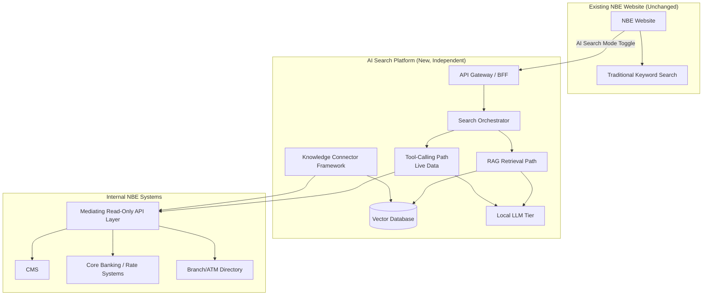

**Key architectural principle:** the AI Search Platform is a peer service to the website, not embedded within it. All communication is via well-defined APIs. The website's existing search stack is never modified or dependent on the new platform's availability.

---

## 7. Detailed Architecture

The platform is decomposed into six logical layers:

1. **Ingestion Layer** — Knowledge Connector Framework; pulls/receives data from all sources, normalizes into Knowledge Documents or Live Data Entities.
2. **Processing Layer** — Cleaning, structure-aware chunking, embedding generation, metadata enrichment (content hash, effective date, source URL).
3. **Storage Layer** — Vector database (semantic index), keyword index (BM25/inverted index for hybrid search), object storage for source documents/PDFs, relational metadata store.
4. **Retrieval & Reasoning Layer** — Hybrid retrieval, reranking, intent classification, tool-calling router, tiered LLM inference, confidence scoring.
5. **API/Orchestration Layer** — Search Orchestrator, API Gateway, caching layer, rate limiting, authentication/authorization.
6. **Observability & Governance Layer** — Distributed tracing, audit logging, admin dashboards, connector health monitoring.

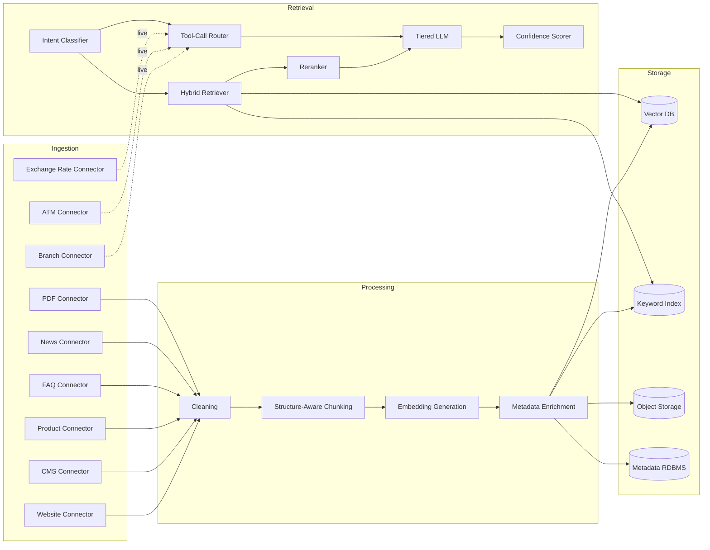

Note the dashed lines: Branch, ATM, and Exchange Rate connectors feed the **live tool-calling path directly**, bypassing the embedding/vector pipeline entirely — this is the structural expression of the dual-path decision from Section 3.

---

## 8. AI Architecture

### 8.1 Dual-Path Retrieval Rationale

A single embedding-based RAG pipeline is unsafe for time-sensitive banking data. Embedding a chunk like "USD/EGP buy rate is 48.90" creates a snapshot that becomes stale the moment the rate changes, yet remains retrievable — and citable — indefinitely until the next sync cycle. The system would present outdated numbers with full apparent authority (a citation link), which is worse than an honest "I don't know."

**Resolution**: intent classification splits queries into two handling paths before retrieval begins.

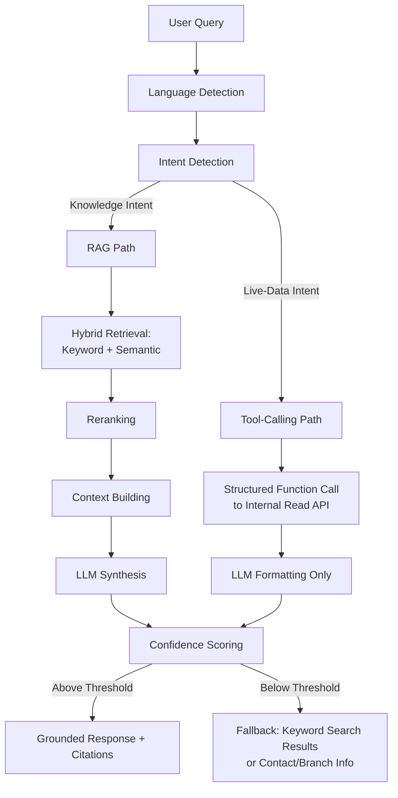

### 8.2 Tiered LLM Strategy

| Tier | Model Class | Use Case | Trigger |
|------|-------------|----------|---------|
| Tier 1 | Small quantized multilingual model (7–13B class, Arabic/English instruction-tuned) | Simple grounded lookups, FAQ-style answers, live-data formatting | Default for all queries |
| Tier 2 | Larger multilingual model | Multi-hop reasoning, comparisons across products, ambiguous queries | Escalated when Tier 1 confidence < threshold |

This tiered approach keeps GPU cost proportional to query complexity rather than running the largest model for every request, and creates a natural seam for later domain fine-tuning (e.g., LoRA adapters per product line) without retraining a monolithic model.

### 8.3 Embedding Model

A local, open-weight multilingual embedding model with strong Arabic (including dialectal) and English support (e.g., multilingual E5-class or BGE-M3-class models, self-hosted). Selection to be validated in Phase 1 via a retrieval-quality benchmark on NBE's own bilingual content before final commitment (see ADR-03).

### 8.4 Confidence Scoring

Confidence is a composite signal, not a single model logit:
- Retrieval similarity score of top-k chunks (RAG path).
- Reranker score.
- Tool-call success/data-freshness signal (tool path).
- LLM self-reported groundedness (optional secondary check via a lightweight groundedness classifier comparing answer against retrieved context).

Below a calibrated threshold, the system does not synthesize a free-text answer — it returns the fallback response defined in FR-08.

---

## 9. Data Flow

### 9.1 Ingestion / Indexing Data Flow

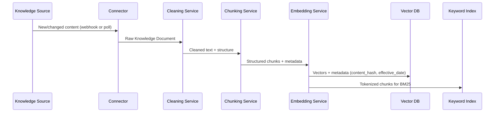

### 9.2 Query-Time Data Flow

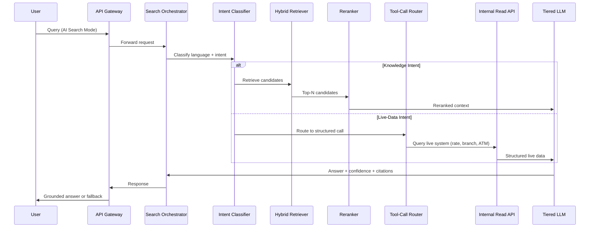

---

## 10. Knowledge Connector Framework

Each connector implements a standard interface:

```typescript
interface KnowledgeConnector {
  id: string;
  sourceType: 'static' | 'live';
  fetchInitial(): Promise<KnowledgeDocument[]>;
  fetchChanges(since: Timestamp): Promise<ChangeSet>;
  supportsWebhook(): boolean;
  registerWebhook?(callbackUrl: string): Promise<void>;
  toStandardDocument(raw: unknown): KnowledgeDocument;
  healthCheck(): Promise<ConnectorHealth>;
}

interface KnowledgeDocument {
  id: string;
  sourceType: string;
  title: string;
  content: string;          // cleaned text, structure-preserved (tables as markdown)
  url: string;               // canonical NBE page link for citation
  language: 'ar' | 'en' | 'mixed';
  effectiveDate: string;
  contentHash: string;       // for idempotent incremental sync
  lastVerified: string;
  metadata: Record<string, unknown>;
}
```

Connectors listed as `sourceType: 'live'` (Exchange Rate, ATM, Branch) do **not** flow into the embedding pipeline. They register with the Tool-Call Router instead, exposing a typed query function (e.g., `getExchangeRate(from, to)`, `getNearestBranch(lat, lng)`).

| Connector | Type | Sync Priority |
|-----------|------|----------------|
| Website Connector | static | Webhook → Crawl fallback |
| CMS Connector | static | CMS API |
| Product Connector | static | CMS API / Internal REST |
| FAQ Connector | static | CMS API |
| PDF Connector | static | Internal REST / manual upload |
| News Connector | static | Webhook / RSS-style poll |
| Branch Connector | live | Internal REST (via Read API) |
| ATM Connector | live | Internal REST (via Read API) |
| Exchange Rate Connector | live | Internal REST (via Read API), near-real-time poll |

The AI Search engine core never contains source-specific logic — it only consumes `KnowledgeDocument` objects or typed live-data function results.

---

## 11. Incremental Synchronization Strategy

Priority order (unchanged from requirements, implementation detail added):

1. **Webhook (preferred)** — source system pushes change events; connector validates signature, converts to standard document, upserts by `id` using `contentHash` to skip no-op updates.
2. **CMS API** — scheduled polling (e.g., every 5 minutes) using `updatedSince` cursors.
3. **Internal REST APIs** — scheduled polling against the mediating Read API layer (see Section 12).
4. **Database Connector** — **not a direct DB connection**; implemented as a scoped, read-only query against the mediating Read API layer only (see Security Architecture rationale).
5. **Incremental website crawl (fallback)** — sitemap-diff based crawl, only for sources with no better integration available; rate-limited and scoped to public pages only.

Only changed documents (identified via `contentHash` mismatch or `updatedSince` cursor) are reprocessed through cleaning → chunking → embedding → upsert. The vector database is **never rebuilt from scratch** during normal operation; full rebuild is reserved for embedding-model version upgrades (see ADR-05), executed as a blue/green index swap.

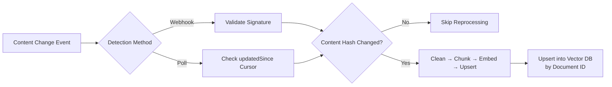

---

## 12. Security Architecture

### 12.1 Zero Trust Principles

- All inter-service communication uses mutual TLS (mTLS) via a service mesh (Istio/Linkerd).
- No implicit trust between namespaces; every request authenticated and authorized regardless of network origin.
- AI Search namespace has **no external network egress** — enforced at the network policy / firewall level, not just application config.

### 12.2 No Direct Database Access (Revised Decision)

The original design's "Database Connector" as direct DB access is replaced with a **mediating, read-only Content API layer**. Rationale:

- Limits blast radius: if the AI Search service is compromised, the attacker reaches only a scoped, read-only API surface — never a primary or replica database directly.
- Creates a single enforceable contract boundary matching the "AI engine never knows where data comes from" principle.
- Enables field-level redaction/masking at the API layer before data ever reaches the AI pipeline (important for connectors touching internal systems adjacent to customer data).

### 12.3 Data Boundaries

- Only **public website content** is used for the initial knowledge base (per original scope).
- Any future extension to authenticated/customer-specific content requires a separate security review and is out of scope for this phase (see Future Enhancements).
- No PII is intentionally ingested; connectors for public content are validated against a PII-detection filter as a defense-in-depth measure before indexing.

### 12.4 Authentication & Authorization

- Enterprise SSO (e.g., NBE's existing SAML/OIDC provider) for internal admin APIs.
- Website-facing AI Search API uses service-to-service tokens issued by the API Gateway; end-user requests are anonymous/session-scoped consistent with current public search behavior, unless NBE requires authenticated-mode search in future.

### 12.5 Auditability

Every AI-generated response is logged with: query (hashed/anonymized if needed for privacy), detected language/intent, retrieved chunk IDs and scores, rerank scores, model tier used, tool calls made, confidence score, and final answer with citations — satisfying Central Bank of Egypt-style audit requirements for automated decision/response systems.

---

## 13. Deployment Architecture

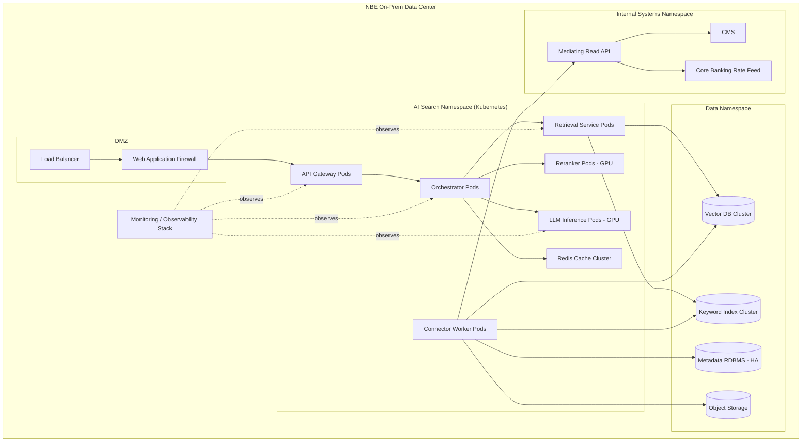

---

## 14. On-Prem Infrastructure

| Component | Recommended Specification |
|-----------|---------------------------|
| Kubernetes Cluster | 3+ master nodes (HA control plane), separate worker pools for CPU vs GPU workloads |
| GPU Nodes | NVIDIA A100/H100-class or L40S-class (cost-tiered), sized per Tier 1/Tier 2 LLM throughput modeling in Phase 1 |
| Vector DB Cluster | Milvus (distributed mode) or pgvector-on-Postgres HA cluster (see ADR-04) |
| Keyword Index | OpenSearch/Elasticsearch cluster (can reuse existing NBE search infra where feasible) |
| Cache Layer | Redis Cluster (HA, persistence enabled for warm-start) |
| Object Storage | On-prem S3-compatible (MinIO) for source documents, PDFs, model artifacts |
| Metadata Store | PostgreSQL HA (Patroni or equivalent) |
| Service Mesh | Istio or Linkerd for mTLS and traffic policy |
| Secrets Management | HashiCorp Vault (on-prem) |
| CI/CD Runners | Self-hosted (GitLab Runner / Jenkins agents) within NBE network |

---

## 15. Technology Stack

| Layer | Technology Options |
|-------|---------------------|
| Orchestration | Kubernetes (on-prem, e.g., OpenShift or vanilla K8s with Rancher) |
| API Gateway | Kong or Apigee (self-hosted) / NGINX + custom BFF |
| Backend Services | Node.js/TypeScript or Python (FastAPI) microservices |
| Embedding Model | Self-hosted multilingual E5/BGE-M3-class model (final selection via Phase 1 benchmark) |
| Vector Database | Milvus (primary recommendation) or pgvector (if Postgres-first ops preferred) |
| Keyword Search | OpenSearch (BM25) |
| Reranker | Self-hosted lightweight cross-encoder (e.g., bge-reranker-base class) |
| LLM Serving | vLLM or TGI (Text Generation Inference) for self-hosted inference serving |
| Tier 1 LLM | Quantized 7–13B multilingual instruction-tuned model |
| Tier 2 LLM | Larger multilingual model, invoked selectively |
| Cache | Redis |
| Message Queue | Kafka or RabbitMQ (for connector event/webhook processing) |
| Observability | OpenTelemetry + Prometheus + Grafana + Loki (logs) + Jaeger/Tempo (traces) |
| CI/CD | GitLab CI or Jenkins, self-hosted |
| IaC | Terraform + Helm charts |

---

## 16. Folder Structure

```
nbe-ai-search-platform/
├── services/
│   ├── api-gateway/
│   ├── search-orchestrator/
│   ├── intent-classifier/
│   ├── hybrid-retriever/
│   ├── reranker-service/
│   ├── tool-call-router/
│   ├── llm-inference-tier1/
│   ├── llm-inference-tier2/
│   └── confidence-scorer/
├── connectors/
│   ├── common/                # shared KnowledgeConnector interface
│   ├── website-connector/
│   ├── cms-connector/
│   ├── product-connector/
│   ├── faq-connector/
│   ├── branch-connector/      # live
│   ├── atm-connector/         # live
│   ├── exchange-rate-connector/ # live
│   ├── news-connector/
│   └── pdf-connector/
├── processing/
│   ├── cleaning-service/
│   ├── chunking-service/
│   └── embedding-service/
├── infra/
│   ├── k8s/
│   ├── helm-charts/
│   ├── terraform/
│   └── istio-policies/
├── observability/
│   ├── dashboards/
│   ├── alerting-rules/
│   └── tracing-config/
├── admin-console/
├── docs/
│   ├── adr/
│   └── runbooks/
└── tests/
    ├── unit/
    ├── integration/
    └── e2e/
```

---

## 17. Development Roadmap

| Phase | Duration | Scope |
|-------|----------|-------|
| Phase 0 — Discovery & Benchmarking | 3 weeks | Embedding model benchmark on NBE bilingual content, infra sizing, security review kickoff |
| Phase 1 — Foundation | 4 weeks | K8s namespace setup, vector DB cluster, keyword index, mediating Read API skeleton |
| Phase 2 — Ingestion | 4 weeks | Website + CMS + FAQ + Product connectors, cleaning/chunking/embedding pipeline |
| Phase 3 — Retrieval Core | 4 weeks | Hybrid retrieval, reranker, Tier 1 LLM integration, RAG path end-to-end |
| Phase 4 — Live Data Path | 3 weeks | Branch/ATM/Exchange Rate connectors, tool-call router, Tier 2 escalation logic |
| Phase 5 — Trust & Safety | 3 weeks | Confidence scoring, abstention/fallback path, citation rendering, audit logging |
| Phase 6 — Hardening | 3 weeks | Security pen-test, load testing, DR drills, observability finalization |
| Phase 7 — Pilot | 4 weeks | Limited internal pilot, feedback loop, tuning |
| Phase 8 — GA Rollout | 2 weeks | Production rollout with AI Search Mode toggle live on website |

**Total estimated timeline: ~30 weeks (~7 months)** to GA, subject to procurement/hardware lead times for GPU infrastructure.

---

## 18. Milestones

1. M1: Embedding/reranker model selection finalized (end of Phase 0).
2. M2: Vector DB + keyword index cluster operational (end of Phase 1).
3. M3: First successful end-to-end incremental sync from CMS webhook (end of Phase 2).
4. M4: RAG path returns grounded, cited answers in internal test environment (end of Phase 3).
5. M5: Live exchange rate/branch queries answered via tool-calling path with zero staleness (end of Phase 4).
6. M6: Full audit trail and abstention behavior verified against test query set (end of Phase 5).
7. M7: Security sign-off and DR drill passed (end of Phase 6).
8. M8: Pilot user acceptance sign-off (end of Phase 7).
9. M9: GA launch (end of Phase 8).

---

## 19. Risks

| Risk | Impact | Likelihood | Mitigation |
|------|--------|------------|------------|
| GPU procurement delays | Schedule slip | Medium | Order hardware at Phase 0 kickoff; consider cloud burst for dev/test only (never prod data) |
| Arabic dialect query understanding underperforms | Poor answer quality | Medium | Phase 0 benchmark against real NBE query logs; fine-tune/adapt as needed |
| Stale live-data despite tool-calling path (API downtime) | Wrong answer risk | Low-Medium | Explicit "data temporarily unavailable" fallback; never silently serve cached live data past TTL |
| Vector DB performance degradation at scale | Latency SLA breach | Medium | Load testing in Phase 6; horizontal sharding strategy pre-validated |
| Connector webhook reliability (missed events) | Index drift | Medium | Reconciliation job comparing source-of-truth checksums on a schedule as safety net |
| Over-reliance on LLM fluency masking wrong answers | Reputational/regulatory risk | Medium-High | Mandatory citation + confidence score display; abstention path; human review sampling |
| Security review findings requiring redesign | Schedule slip | Medium | Early and continuous security architecture involvement (Phase 0 onward, not just Phase 6) |

---

## 20. Future Enhancements

- Authenticated-mode search over customer-specific data (would require separate security/privacy review and likely a segregated deployment).
- Voice-based query input (Arabic/English speech-to-text integration).
- Personalized product recommendations grounded in the same RAG infrastructure.
- Expansion of Tier 2 LLM to support agentic multi-step workflows (e.g., guided account opening assistance) — strictly read-only/informational initially.
- Fine-tuned domain adapters (LoRA) per product line once sufficient query/feedback data is collected.
- Multi-branch/multi-language expansion if NBE extends the platform to other markets.

---

## 21. Sequence Diagrams

See Section 9 (Data Flow) for the primary ingestion and query-time sequence diagrams. Additional sequence diagram for the abstention/fallback path:

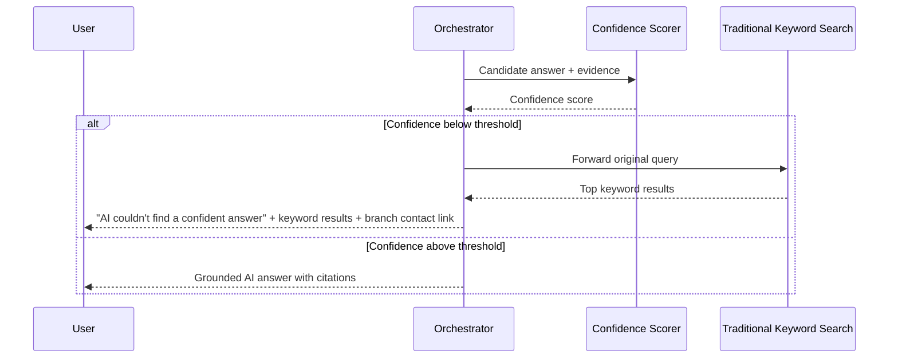

---

## 22. Mermaid Diagrams (Consolidated Index)

| Diagram | Location |
|---------|----------|
| High-Level Architecture | Section 6 |
| Detailed Layered Architecture | Section 7 |
| Dual-Path AI Flow | Section 8.1 |
| Ingestion Sequence | Section 9.1 |
| Query-Time Sequence | Section 9.2 |
| Incremental Sync Flow | Section 11 |
| Deployment Diagram | Section 13 |
| Abstention Sequence | Section 21 |

---

## 23. Component Diagrams

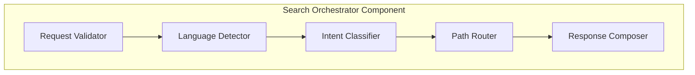

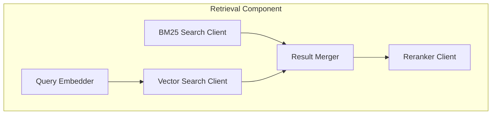

---

## 24. Deployment Diagram

See Section 13 for the full Kubernetes-namespace-level deployment diagram, covering DMZ, AI Search namespace, Data namespace, and Internal Systems namespace, with the observability stack overlaying all.

---

## 25. Class Diagram

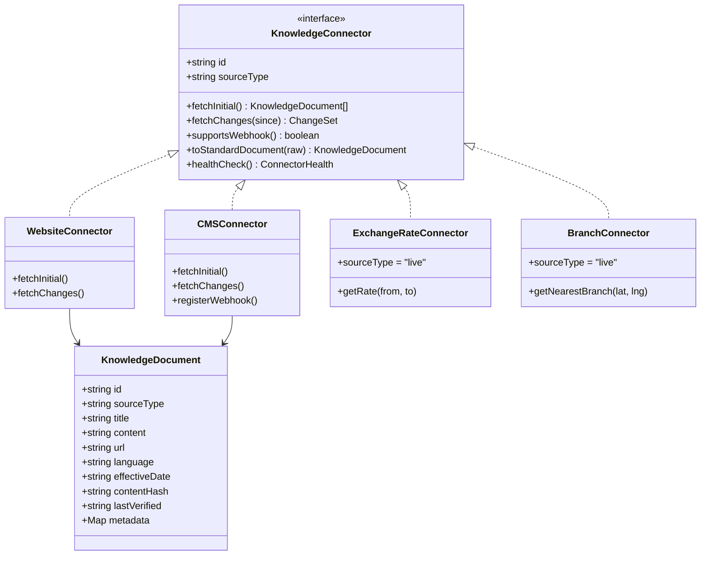

---

## 26. APIs

### 26.1 Public-Facing (via Website)

```
POST /v1/search
Body: { query: string, language?: "ar"|"en"|"auto", sessionId?: string }
Response: {
  answer: string | null,
  confidence: number,
  citations: [{ title, url, snippet }],
  fallback: boolean,
  fallbackResults?: [{ title, url }]
}
```

### 26.2 Internal Admin APIs

```
POST /v1/admin/connectors/{connectorId}/sync   — trigger manual sync
GET  /v1/admin/connectors/{connectorId}/health  — connector health status
POST /v1/admin/reindex                          — controlled full reindex (blue/green)
GET  /v1/admin/queries/{queryId}/trace           — full audit trace for a query
```

### 26.3 Tool-Calling Internal Functions

```
getExchangeRate(from: CurrencyCode, to: CurrencyCode) -> { rate, timestamp, source }
getNearestBranch(lat: number, lng: number) -> Branch[]
getNearestATM(lat: number, lng: number) -> ATM[]
```

---

## 27. Database Design

### 27.1 Metadata RDBMS (PostgreSQL)

```sql
CREATE TABLE knowledge_documents (
    id UUID PRIMARY KEY,
    source_type VARCHAR(50) NOT NULL,
    title TEXT NOT NULL,
    url TEXT NOT NULL,
    language VARCHAR(10) NOT NULL,
    effective_date TIMESTAMP,
    content_hash VARCHAR(64) NOT NULL,
    last_verified TIMESTAMP NOT NULL,
    vector_id VARCHAR(100),
    created_at TIMESTAMP DEFAULT now(),
    updated_at TIMESTAMP DEFAULT now()
);

CREATE TABLE connector_sync_state (
    connector_id VARCHAR(100) PRIMARY KEY,
    last_synced_at TIMESTAMP,
    last_cursor TEXT,
    status VARCHAR(20)
);

CREATE TABLE query_audit_log (
    query_id UUID PRIMARY KEY,
    query_text TEXT,
    language VARCHAR(10),
    intent VARCHAR(50),
    model_tier VARCHAR(20),
    confidence_score NUMERIC,
    retrieved_chunk_ids TEXT[],
    tool_calls JSONB,
    final_answer TEXT,
    created_at TIMESTAMP DEFAULT now()
);
```

---

## 28. Vector Database Design

**Recommendation: Milvus** (distributed mode) as primary, with **pgvector** as an accepted alternative if NBE's ops team prioritizes operational simplicity over maximum horizontal scale (see ADR-04).

| Aspect | Design |
|--------|--------|
| Collection Schema | `id (UUID)`, `vector (float[])`, `content_hash`, `effective_date`, `source_url`, `language`, `source_type` |
| Index Type | HNSW (balanced recall/latency) |
| Sharding | By language (ar/en) and/or source_type for large collections |
| Upsert Strategy | Upsert by document `id`; skip if `content_hash` unchanged |
| Backup/DR | Scheduled snapshot to object storage; point-in-time recovery via WAL where supported |
| Reindex Strategy | Blue/green: build new collection on embedding-model upgrade, swap alias atomically |

---

## 29. Performance Optimization

- **Semantic response caching**: cache (query embedding → grounded answer) for static/RAG-path queries only; invalidated via `content_hash`/`effective_date` — never applied to live-data path.
- **Reranker batching**: GPU-batched reranking to amortize inference cost under load.
- **Tiered LLM routing**: majority of traffic served by the smaller, faster Tier 1 model.
- **Connection pooling** and **async I/O** throughout the orchestrator and retrieval services.
- **Precomputed embeddings** for all static content; only the user query is embedded at request time.
- **CDN/edge caching** not applicable for AI answers (dynamic), but static assets of the widget itself can be CDN-cached internally.

---

## 30. Enterprise Best Practices

- Contract-first API design (OpenAPI specs versioned in source control).
- Infrastructure as Code for all environments (dev/staging/prod parity).
- Immutable deployments via container images; no in-place server mutation.
- Feature flags for gradual rollout of AI Search Mode (percentage-based exposure).
- Runbooks for every failure mode (connector down, vector DB degraded, LLM inference saturated).
- Regular red-team exercises against the AI Search API (prompt injection via ingested content is a specific test case, given content is sourced from CMS/website).

---

## 31. DevOps Pipeline

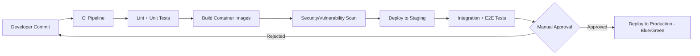

---

## 32. Monitoring Strategy

| Signal | Tooling | Purpose |
|--------|---------|---------|
| Metrics | Prometheus + Grafana | Latency, throughput, GPU utilization, cache hit rate |
| Logs | Loki | Structured application and connector logs |
| Traces | Jaeger/Tempo (OpenTelemetry) | Per-query distributed trace across all services |
| RAG-Specific Trace | Custom audit store (query_audit_log) | Retrieved chunks, scores, model tier, confidence, tool calls |
| Alerting | Alertmanager | SLA breaches, connector sync failures, GPU saturation, abstention-rate spikes |
| Abstention Rate Dashboard | Grafana | Tracks how often the system falls back — a proxy for knowledge base gaps |

---

## 33. Testing Strategy

- **Unit tests**: connectors, chunking logic, confidence scoring functions.
- **Integration tests**: end-to-end ingestion pipeline per connector; end-to-end query pipeline per path (RAG and tool-calling).
- **Retrieval quality benchmark**: curated Arabic/English query set with known correct answers, measured via recall@k and answer accuracy.
- **Load testing**: simulate peak website traffic patterns against both search paths.
- **Security testing**: penetration testing, prompt-injection testing against ingested content, access-control testing on admin APIs.
- **Chaos/DR testing**: simulate vector DB node failure, connector outage, LLM inference pod crash; verify graceful degradation to keyword search fallback.

---

## 34. Acceptance Criteria

- AI Search Mode operates independently without any modification to existing keyword search behavior.
- No external network calls originate from the AI Search namespace (verified via network policy audit).
- Live-data queries (rates, branches, ATMs) never return data older than the defined freshness SLA, or explicitly state data is unavailable.
- Every AI-generated answer includes at least one citation linking to a real NBE page, or is suppressed in favor of the fallback response.
- Full audit trace retrievable for any given query within the retention period.
- System passes security review with no critical/high findings unresolved.
- P95 latency targets from Section 5 met under designed peak load.

---

## 35. Architecture Decision Records (ADR)

**ADR-01: Dual-path retrieval instead of unified RAG-only pipeline**
Status: Accepted. Context: original design risked embedding time-sensitive data. Decision: split live-data queries into a structured tool-calling path. Consequence: added routing complexity, eliminated staleness/hallucination risk for financial data.

**ADR-02: Mediating Read API instead of direct database connector**
Status: Accepted. Context: direct DB access as a sync mechanism increases blast radius. Decision: all connectors interact only with a scoped, read-only internal API layer. Consequence: additional API layer to build/maintain, significantly reduced attack surface.

**ADR-03: Embedding model selection deferred to Phase 0 benchmark**
Status: Accepted. Context: Arabic dialectal performance varies significantly across open multilingual embedding models. Decision: benchmark candidates against real NBE bilingual content before commitment.

**ADR-04: Vector database — Milvus primary, pgvector acceptable alternative**
Status: Accepted. Context: NBE ops team's existing Postgres investment vs. need for horizontal scale. Decision: default to Milvus; pgvector permitted if ops constraints dominate, with documented scale tradeoffs.

**ADR-05: Full reindex only via blue/green swap on embedding model upgrade**
Status: Accepted. Context: requirement to never rebuild the entire vector database in normal operation. Decision: full rebuilds are an explicit, rare, controlled operation tied only to model version upgrades.

**ADR-06: Tiered LLM strategy instead of single large model**
Status: Accepted. Context: cost and latency concerns of running one large model for all query types. Decision: small model default, large model escalation on low confidence.

---

## 36. Final Implementation Roadmap

1. Secure Enterprise Architecture Board approval of this document, including the dual-path retrieval revision (ADR-01) and mediating Read API decision (ADR-02).
2. Kick off Phase 0 embedding/reranker benchmarking against real NBE bilingual query samples.
3. Procure GPU infrastructure in parallel with Phase 0/1 to avoid critical-path delay.
4. Stand up Kubernetes namespaces, network policies, and service mesh before any connector development begins (security-first sequencing).
5. Build connectors in priority order: Website → CMS → FAQ/Product → PDF → News → (live) Branch/ATM/Exchange Rate.
6. Implement RAG path fully before introducing tool-calling path, to validate grounded-answer quality independently.
7. Integrate tool-calling path and confidence-based escalation logic.
8. Complete full audit logging and abstention behavior before any pilot exposure.
9. Run internal pilot with feature-flagged rollout percentage, monitor abstention rate and citation accuracy closely.
10. GA rollout with AI Search Mode toggle live on the NBE website, keyword search unchanged as the default.

---

*End of Document*
