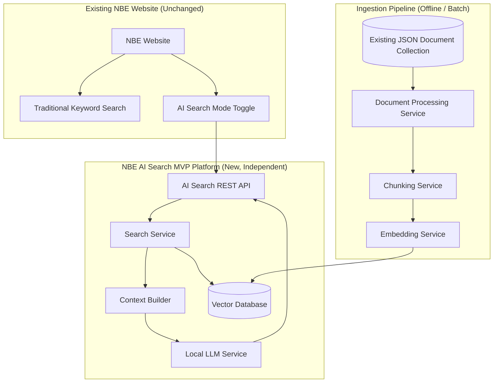
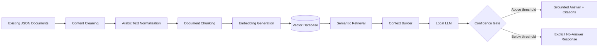
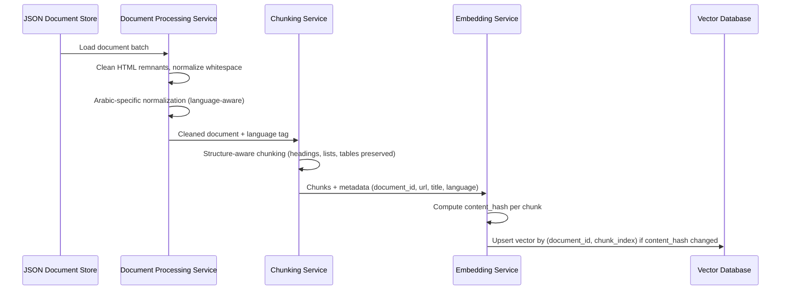
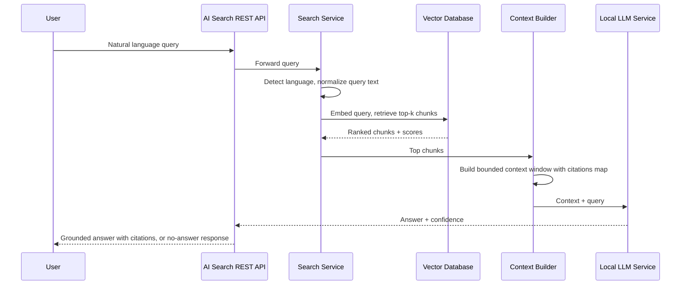
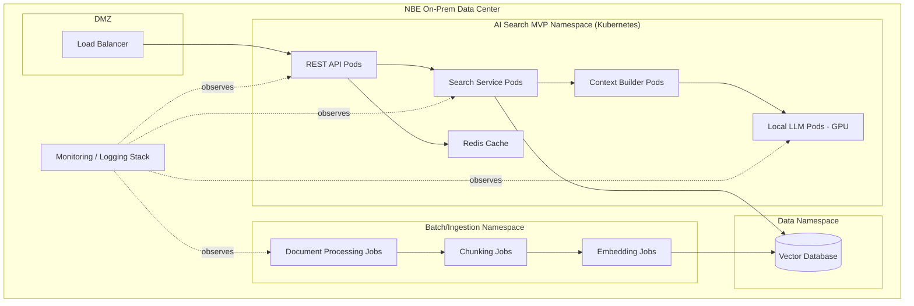
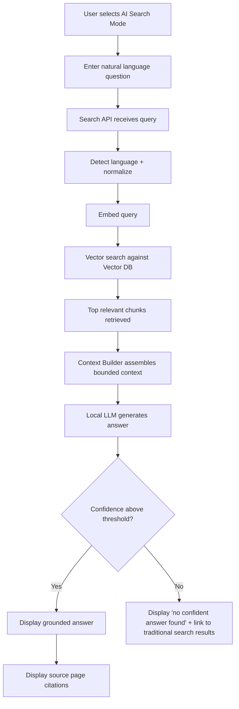
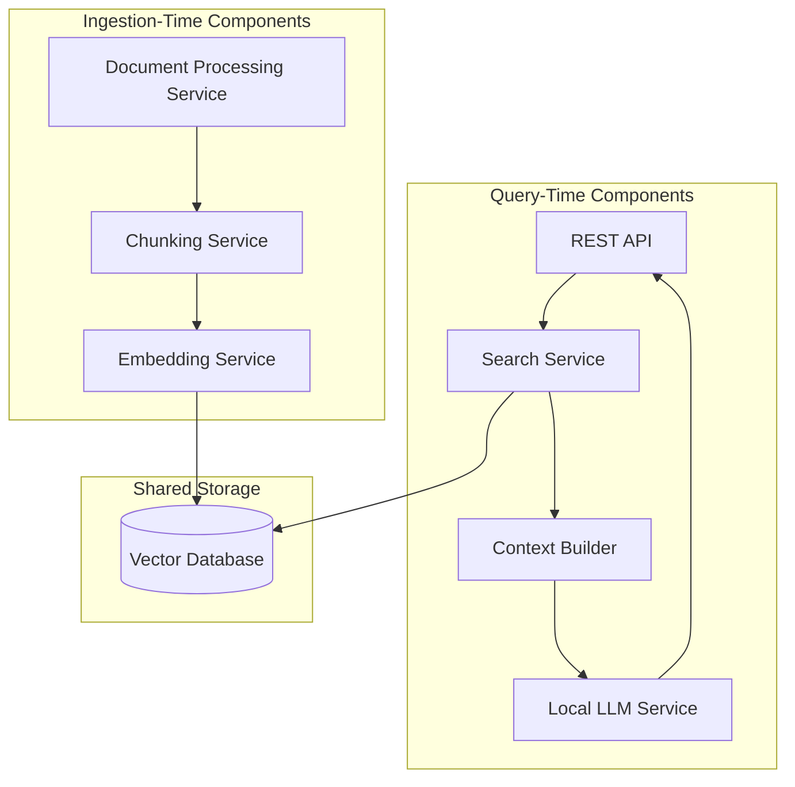
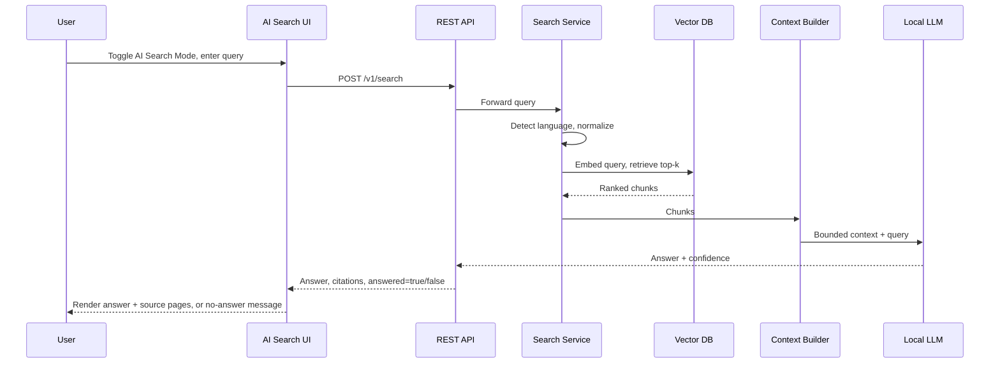
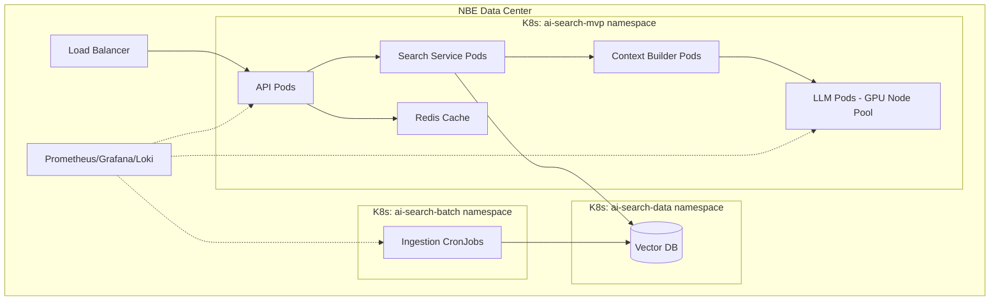
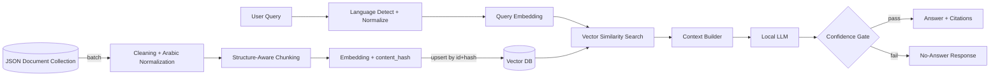

# NBE AI Search MVP
## Implementation Plan & Enterprise Architecture Document

**Document Classification:** Internal / Confidential
**Version:** 1.0 (MVP)
**Prepared for:** CTO Office, Enterprise Architecture Board, National Bank of Egypt
**Document Type:** Production Implementation Plan — MVP Scope

---

## Table of Contents

1. Executive Summary
2. Project Vision
3. Business Problem
4. Proposed Solution
5. MVP Scope
6. Functional Requirements
7. Non-Functional Requirements
8. High-Level Architecture
9. AI Architecture
10. RAG Pipeline
11. Data Flow
12. Component Responsibilities
13. Folder Structure
14. Technology Stack
15. Deployment Architecture
16. Security Architecture
17. Performance Optimization
18. Search Flow
19. API Overview
20. Monitoring Strategy
21. Logging Strategy
22. Testing Strategy
23. Acceptance Criteria
24. Risks
25. Limitations
26. Future Roadmap
27. Mermaid Component Diagram
28. Mermaid Sequence Diagram
29. Mermaid Deployment Diagram
30. Mermaid Data Flow Diagram
31. Architecture Decision Records (ADR)
32. Final Implementation Roadmap

---

## 1. Executive Summary

This document defines the implementation plan for **NBE AI Search MVP**, an on-premises, Retrieval-Augmented Generation (RAG) search platform that adds an optional "AI Search Mode" to the existing NBE website, alongside the unchanged traditional keyword search.

Scope for this MVP begins **after** content acquisition: website scraping and initial extraction are already complete, and the input to this pipeline is a stable collection of JSON documents (`id`, `title`, `url`, `language`, `content`, `metadata`). The MVP's job is to take these documents and build a bilingual (Arabic/English) semantic search experience that returns grounded, cited answers via a locally hosted LLM — with no cloud dependency and no data leaving NBE infrastructure.

The plan below follows the requested pipeline shape but tightens several decisions that would otherwise create quality, cost, or maintainability problems at MVP stage: language-aware normalization and chunking, an idempotent ingestion contract keyed on document `id` and content hash (so re-running ingestion is safe), a grounding-and-abstention gate that stops the LLM from answering when retrieval evidence is weak, and a technology stack sized appropriately for an MVP rather than an over-built enterprise platform. These refinements are documented as ADRs in Section 31.

---

## 2. Project Vision

Deliver a working, demonstrable AI Search Mode for the NBE website that proves the core value proposition — natural-language, bilingual, evidence-grounded answers with source citations — on real NBE content, using a fully on-premises stack, as the foundation for the larger Enterprise AI Search Platform roadmap.

---

## 3. Business Problem

Traditional keyword search on the NBE website requires customers to guess exact terms used on the site. Natural questions, especially in Egyptian Arabic colloquial phrasing, often fail to match indexed keywords even when the answer exists on the site. Customers cannot get a direct answer synthesized across pages; they can only get a list of pages to read themselves. This MVP validates that a locally hosted RAG pipeline can close this gap without any change to the existing site or any data leaving the bank.

---

## 4. Proposed Solution

A new, independent AI Search service that:

- Ingests the already-produced JSON document collection (no scraping logic in scope).
- Cleans and normalizes text, with explicit Arabic-specific normalization.
- Chunks documents in a structure- and language-aware manner.
- Generates multilingual embeddings and stores them in a vector database.
- Performs semantic retrieval at query time, builds a grounded context, and calls a local LLM to synthesize an answer.
- Returns the answer with confidence and citations back to the website UI via a REST API, only when retrieved evidence supports an answer — otherwise it returns an explicit "no confident answer" response rather than guessing.
- Runs entirely on-premises: no cloud AI services, no external network calls.

---

## 5. MVP Scope

**In scope:**
- Ingestion pipeline starting from existing JSON documents.
- Cleaning, Arabic normalization, chunking, embedding, vector storage.
- Semantic retrieval + context building + local LLM answer synthesis.
- REST API for search.
- Minimal frontend toggle (AI Search Mode vs Traditional Search) — can reuse existing site's UI shell.
- Citations to source URLs.
- Basic confidence scoring and abstention behavior.
- Monitoring, logging, and basic caching.

**Out of scope (for this MVP; see Future Roadmap):**
- Scraping/content acquisition (already complete).
- Live/time-sensitive data sources (exchange rates, branch/ATM lookups) — these belong to a separate, non-RAG tool-calling path and are explicitly excluded from this MVP to avoid conflating static and live data (see ADR-01).
- Incremental/webhook-based content synchronization — MVP assumes periodic batch re-ingestion of the JSON collection; continuous sync is a post-MVP enhancement.
- Authenticated/customer-specific content.
- Multi-connector framework (single JSON-document ingestion path only, kept extensible for future connectors).

---

## 6. Functional Requirements

| ID | Requirement |
|----|-------------|
| FR-01 | Ingest documents from the existing JSON collection (`id`, `title`, `url`, `language`, `content`, `metadata`). |
| FR-02 | Detect and normalize Arabic text (including Egyptian colloquial variants) distinctly from English text. |
| FR-03 | Chunk documents while preserving structure (headings, lists, tables) and respecting language boundaries in mixed-language documents. |
| FR-04 | Generate multilingual embeddings for each chunk and store with metadata (`document_id`, `chunk_id`, `url`, `title`, `language`, `content_hash`). |
| FR-05 | Accept a natural-language query in Arabic or English, detect language, embed, and perform semantic retrieval. |
| FR-06 | Build a grounded context window from top-ranked retrieved chunks. |
| FR-07 | Generate an answer using a local LLM constrained to the retrieved context only. |
| FR-08 | Return a confidence score with every answer. |
| FR-09 | Return source page citations (title + URL) for every answer. |
| FR-10 | Return an explicit "no confident answer" response (not a guess) when retrieval confidence is below threshold. |
| FR-11 | Re-run ingestion safely and idempotently — re-ingesting the same JSON collection must not create duplicate vectors (upsert by `id` + `content_hash`). |
| FR-12 | Expose all functionality via a versioned REST API consumed by the AI Search UI toggle. |

---

## 7. Non-Functional Requirements

| Category | Requirement |
|----------|-------------|
| Latency | P95 query latency ≤ 2.5s end-to-end for MVP load (single-region, on-prem). |
| Scalability | Each service independently scalable (stateless services horizontally scalable; vector DB scalable via sharding/replication). |
| Caching | Query-result caching for repeated queries on unchanged content. |
| Monitoring | Metrics for latency, retrieval quality signals, abstention rate, GPU utilization. |
| Logging | Structured logs per pipeline stage; per-query audit record. |
| Availability | Target 99.5% for MVP (lower than full enterprise platform target, appropriate for MVP phase). |
| Observability | Distributed tracing across ingestion and query pipelines. |
| Maintainability | Clear service boundaries; no cross-service shared database schemas. |
| Extensibility | Document schema and connector boundary designed to allow additional sources post-MVP without redesign. |

---

## 8. High-Level Architecture



The ingestion pipeline runs as an offline/batch process, decoupled from the query-time path. The website and its existing keyword search remain fully untouched; the only website-side change is the addition of a UI toggle that calls the new API.

---

## 9. AI Architecture

### 9.1 Design Principle: Grounded-Only Answers

The LLM is never permitted to answer from parametric knowledge. Every prompt sent to the LLM includes only retrieved chunk content as context, with an explicit instruction to answer only from the provided context and to state uncertainty if the context is insufficient. This is enforced at two levels:
1. **Prompt-level constraint** — the system prompt restricts the model to the provided context.
2. **Post-hoc confidence gate** — a composite score (retrieval similarity + rerank score, if used, + context sufficiency check) determines whether the answer is returned at all (FR-10).

### 9.2 Bilingual Handling

- Language is detected per query (and was already recorded per document during ingestion via the `language` field).
- A single multilingual embedding model is used for both Arabic and English so that cross-language semantic matching remains possible (e.g., an English query can still retrieve a highly relevant Arabic-only page), rather than maintaining two separate embedding spaces.
- Arabic normalization (diacritics removal, Alef/Yeh/Taa Marbuta normalization, elongation removal) is applied at ingestion time and at query time consistently, so embeddings are computed on comparably normalized text.

### 9.3 MVP LLM Sizing

For MVP, a single local LLM tier is recommended (rather than the tiered small/large model strategy appropriate for the full enterprise platform) — a quantized 7–13B class multilingual instruction-tuned model, sized to run within the MVP's GPU budget. Tiered model routing is deferred to the post-MVP roadmap once real query complexity data is available (see ADR-05).

---

## 10. RAG Pipeline



Each stage has a single, testable responsibility, and stages communicate via well-defined data contracts (see Section 12), so any stage can be modified or replaced independently — e.g., swapping the embedding model or vector database later without touching chunking or the LLM service.

---

## 11. Data Flow

### 11.1 Ingestion Data Flow (Batch)



### 11.2 Query-Time Data Flow



---

## 12. Component Responsibilities

| Component | Responsibility | Explicitly NOT Responsible For |
|-----------|------------------|-------------------------------|
| Document Processing Service | Load JSON documents, strip residual HTML/markup, normalize whitespace, apply Arabic-specific normalization | Chunking, embedding, scraping |
| Chunking Service | Split cleaned documents into structure-aware chunks, assign stable `chunk_id` | Embedding, storage |
| Embedding Service | Generate vector embeddings per chunk, compute `content_hash`, upsert to vector DB | Retrieval, ranking |
| Vector Database | Store vectors + metadata, serve nearest-neighbor queries | Business logic, ranking beyond similarity |
| Search Service | Query language detection, query embedding, retrieval orchestration, threshold logic | Answer generation |
| Context Builder | Assemble bounded context from retrieved chunks, maintain citation mapping | Retrieval, generation |
| Local LLM Service | Generate grounded answer strictly from provided context, emit confidence signal | Retrieval, source-of-truth for facts not in context |
| REST API | Expose versioned endpoints, request validation, rate limiting, response shaping | Business/AI logic |
| Frontend (AI Search Mode toggle) | Present toggle, submit queries, render answer + citations | Search/AI logic (thin client only) |

---

## 13. Folder Structure

```
nbe-ai-search-mvp/
├── ingestion/
│   ├── document-processing-service/
│   ├── chunking-service/
│   └── embedding-service/
├── services/
│   ├── search-service/
│   ├── context-builder/
│   ├── llm-service/
│   └── api/
├── data/
│   ├── vector-db-config/
│   └── schemas/               # JSON document contract, chunk contract
├── frontend/
│   └── ai-search-toggle/
├── infra/
│   ├── k8s/
│   ├── helm-charts/
│   └── docker/
├── observability/
│   ├── dashboards/
│   └── alerting-rules/
├── docs/
│   └── adr/
└── tests/
    ├── unit/
    ├── integration/
    └── e2e/
```

---

## 14. Technology Stack

| Component | Recommended | Alternative(s) | Advantages | Disadvantages | On-Prem Banking Fit |
|-----------|-------------|------------------|------------|----------------|----------------------|
| **Backend / API Framework** | Python + FastAPI | Node.js + NestJS | FastAPI has first-class async support, strong typing via Pydantic, easy OpenAPI generation; Python ecosystem aligns with ML tooling | Python concurrency model weaker than Node for very high I/O concurrency at extreme scale | MVP scale doesn't need Node's concurrency ceiling; Python simplifies integration with embedding/LLM tooling used by the same team |
| **Document Processing** | Python (BeautifulSoup for residual HTML cleanup, custom Arabic normalization module using `pyarabic` or `CAMeL Tools`) | Custom Node.js cleaning scripts | Mature Arabic NLP libraries (CAMeL Tools) built specifically for Arabic dialect handling | Slight learning curve for team unfamiliar with Arabic NLP tooling | Purpose-built Arabic normalization is essential — generic cleaning misses dialectal/orthographic variation |
| **Chunking Strategy** | Structure-aware chunking (respect HTML headings/lists/tables already present in `content` field before residual cleanup) with fixed token-size fallback (~300–500 tokens, ~50-token overlap) | Pure fixed-size chunking | Preserves tables/lists critical to banking content (fee schedules, rates tables) | Slightly more engineering effort than naive fixed-size split | Prevents the "split table row in half" failure mode that produces wrong numbers |
| **Embedding Model** | Self-hosted multilingual model (e.g., BGE-M3-class or multilingual-E5-class, validated against NBE Arabic/English samples) | OpenAI/Cohere embeddings (cloud) | Strong multilingual + Arabic performance in open-weight models available today; fully self-hostable | Requires GPU capacity for embedding batch jobs; open models slightly behind best cloud APIs on some benchmarks | Cloud embedding APIs are disallowed outright by the on-prem/no-external-network requirement — self-hosted is not optional here |
| **Vector Database** | Milvus (standalone mode acceptable for MVP scale) | pgvector (Postgres extension), Qdrant | Milvus purpose-built for vector search at scale, strong HNSW support, clean path to distributed mode later | Adds a new database technology to operate vs. reusing existing Postgres skillset | For MVP scale, pgvector is a legitimate lower-ops-overhead alternative if the team already runs Postgres — documented as a scoped decision, revisit at full-platform stage |
| **Local LLM Serving** | vLLM (serving a quantized 7–13B multilingual instruction-tuned model) | TGI (Text Generation Inference), Ollama (simpler, less throughput-optimized) | vLLM offers strong throughput via continuous batching and PagedAttention, mature production track record | Requires GPU infra and moderate ops maturity to run well | Ollama is simpler to stand up for a quick MVP demo but underperforms at concurrent request volume; recommend vLLM if MVP will see real concurrent traffic, Ollama acceptable for an internal proof-of-concept slice |
| **Frontend** | Lightweight React component embedded into existing site shell | Vue component | Matches common enterprise frontend tooling; easy to integrate as a toggle without touching the rest of the site | N/A — must match existing site's frontend stack if not React | Confirm existing site's frontend framework before final selection to minimize integration friction |
| **Containerization** | Docker | Podman | Universal support, mature tooling, works cleanly with Kubernetes | Root daemon security considerations (mitigated via rootless mode or Podman if preferred) | Standard for on-prem K8s deployments; rootless mode addresses banking security posture concerns |
| **Deployment/Orchestration** | Kubernetes (on-prem, e.g., via Rancher or OpenShift) | Docker Compose (MVP-only, single-node) | K8s gives production-grade scaling/self-healing; Compose is faster to stand up for a pure MVP demo | K8s has higher initial setup overhead | Recommend Docker Compose ONLY for an early internal proof-of-concept; move to K8s before any real user-facing pilot, to avoid a costly re-platforming later |
| **Monitoring** | Prometheus + Grafana | Datadog (cloud — disallowed) | Fully self-hostable, strong Kubernetes-native ecosystem | Requires self-managed alerting/dashboard setup | Cloud monitoring SaaS conflicts with no-external-network requirement |
| **Logging** | Loki (paired with Grafana) or ELK stack | Splunk (often licensed, heavier) | Loki is lightweight and integrates directly with Grafana/Prometheus stack already chosen | ELK stack more mature for complex log querying but heavier to operate | Either is on-prem-safe; Loki chosen for stack consistency and lower operational footprint at MVP scale |

---

## 15. Deployment Architecture



Ingestion runs as scheduled batch jobs (e.g., Kubernetes CronJobs) in a separate namespace from the query-time services, so a heavy re-ingestion run cannot starve query-time latency.

---

## 16. Security Architecture

- **Zero external egress** from the AI Search namespace, enforced via network policy at the Kubernetes/firewall level, not just application configuration.
- **No cloud AI APIs** used anywhere in the pipeline — embedding and LLM inference are both self-hosted.
- **Only public website content** is indexed in this MVP; no PII or authenticated customer data enters the pipeline.
- **mTLS between internal services** via a lightweight service mesh or, at minimum, mutual TLS certificates managed through the existing NBE PKI, appropriate for MVP scale.
- **API authentication**: the AI Search REST API sits behind the same authentication/session boundary as the existing website; no new customer-facing auth surface introduced.
- **Content integrity**: since ingested content is public web content, defense-in-depth prompt-injection testing should be included (a malicious actor could theoretically get injected text onto a public page reflected into the knowledge base) — the LLM prompt template constrains the model to answer factually from context and never execute instructions found inside retrieved content.

---

## 17. Performance Optimization

- **Query-result caching**: cache by normalized-query-text + language, invalidated when underlying `content_hash` values for cited chunks change during re-ingestion.
- **Idempotent upsert ingestion**: skip re-embedding of unchanged chunks via `content_hash` comparison, keeping batch re-ingestion fast and cheap.
- **Bounded context windows**: Context Builder caps total tokens sent to the LLM, prioritizing highest-scoring chunks to keep inference latency predictable.
- **Precomputed embeddings**: only the user query is embedded at request time; all document embeddings are precomputed during ingestion.
- **GPU batching** for embedding generation during ingestion jobs to maximize throughput on batch runs.

---

## 18. Search Flow



---

## 19. API Overview

```
POST /v1/search
Request:  { query: string, language?: "ar"|"en"|"auto" }
Response: {
  answer: string | null,
  confidence: number,
  citations: [ { title: string, url: string } ],
  answered: boolean
}

GET /v1/health
Response: { status: "ok" | "degraded", components: { vectorDb, llm, api } }

POST /v1/admin/ingest
Trigger a batch ingestion run over the current JSON document collection (idempotent).

GET /v1/admin/ingest/status/{runId}
Returns status of an ingestion run (documents processed, chunks upserted, errors).
```

All endpoints are versioned under `/v1/` from day one to allow non-breaking evolution post-MVP.

---

## 20. Monitoring Strategy

| Signal | Tool | Purpose |
|--------|------|---------|
| API latency, throughput | Prometheus + Grafana | SLA tracking |
| GPU utilization (embedding + LLM) | Prometheus (node/GPU exporters) + Grafana | Capacity planning |
| Cache hit rate | Prometheus | Effectiveness of query caching |
| Abstention rate | Custom metric, Grafana dashboard | Proxy for knowledge base coverage gaps; a rising abstention rate signals content gaps worth investigating |
| Ingestion job success/failure | Prometheus + Alertmanager | Batch pipeline health |
| Vector DB query latency | Prometheus | Retrieval-layer health |

---

## 21. Logging Strategy

- Structured (JSON) logs at every pipeline stage: ingestion (document processed, chunk count, errors), query-time (query received, retrieval results count, confidence score, answered/abstained).
- Centralized via Loki, queryable through Grafana.
- Per-query audit record retained (query text, language, retrieved chunk IDs + scores, confidence, final answer, citations) to support later audit/compliance needs even at MVP stage, at low incremental cost.
- No raw customer PII expected in logs given public-content-only scope; log redaction policy documented for future phases where customer-specific queries might include PII in free text.

---

## 22. Testing Strategy

- **Unit tests**: cleaning/normalization functions, chunking boundaries, content-hash idempotency logic, confidence-gate thresholding.
- **Integration tests**: full ingestion pipeline against a sample JSON document set; full query pipeline against a known small corpus with expected answers.
- **Retrieval quality benchmark**: a curated bilingual (Arabic/English) test query set with known correct source pages, measured via recall@k.
- **Answer grounding tests**: verify the LLM does not answer when context is deliberately withheld or irrelevant (adversarial "no evidence" test cases) — this directly tests the "never hallucinate" requirement.
- **Load testing**: baseline concurrent query load for MVP-scale traffic assumptions.
- **Idempotency testing**: re-run ingestion twice on identical input, verify no duplicate vectors and no unnecessary re-embedding.

---

## 23. Acceptance Criteria

- AI Search Mode functions as an additive toggle; traditional search remains fully unchanged and available.
- No external network calls originate from the AI Search MVP namespace.
- Every returned answer includes at least one valid source citation, or the system returns an explicit no-answer response instead.
- Adversarial "no evidence" test cases produce the no-answer response, not a fabricated answer.
- Re-running ingestion on an unchanged document set produces zero duplicate vectors and no unnecessary re-embedding work.
- P95 query latency meets the target defined in Section 7 under MVP load testing conditions.
- Arabic and English queries both retrieve relevant results with acceptable recall@k on the benchmark test set.

---

## 24. Risks

| Risk | Impact | Likelihood | Mitigation |
|------|--------|------------|------------|
| Open-weight embedding model underperforms on Egyptian Arabic colloquial queries | Poor retrieval quality | Medium | Benchmark against real/representative NBE query samples before committing; budget time for embedding model comparison |
| GPU capacity insufficient for concurrent embedding + LLM inference during ingestion + query overlap | Latency spikes | Medium | Separate namespaces/node pools for batch ingestion vs. query-time inference (Section 15) |
| Chunking splits banking-specific tables/lists, degrading answer accuracy on numeric content | Wrong or incomplete answers | Medium | Structure-aware chunking (Section 14), specific test cases for tabular content |
| Vector DB technology choice needs revisiting at full-platform scale | Rework cost later | Low-Medium | Document the MVP choice as a scoped decision (ADR), not a permanent architectural commitment |
| Static JSON snapshot becomes stale relative to live website content | Answers reference outdated content | Medium | Explicit MVP limitation (Section 25); scheduled batch re-ingestion cadence defined even at MVP stage |

---

## 25. Limitations

- This MVP operates on a **static snapshot** of already-scraped JSON documents. It does not include continuous/incremental synchronization with the live website; content freshness depends entirely on how often the upstream JSON collection is regenerated and re-ingested.
- No live/time-sensitive data (exchange rates, branch/ATM availability) is supported — these require a fundamentally different, non-embedding-based data path and are explicitly deferred (see ADR-01 and Future Roadmap).
- Single-language-model embedding approach is not yet benchmarked against NBE's actual content; quality assumptions should be validated early, not assumed.
- MVP availability target (99.5%) and single-LLM-tier design are appropriate for a pilot, not yet a full enterprise SLA.

---

## 26. Future Roadmap

- Introduce a **live-data tool-calling path** (exchange rates, branch/ATM lookups) as a structured, non-RAG addition, following the same principle used in the full Enterprise AI Search Platform design — never embed time-sensitive data as static text.
- Build a **Knowledge Connector Framework** to support additional sources beyond the current JSON snapshot (CMS webhooks, PDF connector, product/FAQ APIs), replacing static batch ingestion with incremental synchronization.
- Introduce a **tiered LLM strategy** (small model default, larger model escalation) once real production query complexity data justifies it.
- Add a **reranking stage** between retrieval and context building if recall@k benchmarking shows retrieval precision needs improvement beyond what raw vector similarity provides.
- Expand vector database to distributed/sharded deployment if MVP proves the concept and traffic scales.
- Formal audit-trail retention policy and Central Bank of Egypt compliance review ahead of any customer-facing GA.

---

## 27. Mermaid Component Diagram



---

## 28. Mermaid Sequence Diagram



---

## 29. Mermaid Deployment Diagram



---

## 30. Mermaid Data Flow Diagram



---

## 31. Architecture Decision Records (ADR)

**ADR-01: Exclude live/time-sensitive data from this MVP's RAG pipeline**
Status: Accepted. Context: the requested pipeline is purely document/embedding based; introducing live data (rates, branch/ATM) into the same embedding store would risk stale answers presented with false confidence. Decision: MVP scope is limited to static, already-scraped public content; live-data support is explicitly deferred to a separate, non-embedding tool-calling path in a future phase. Consequence: MVP cannot answer live-data questions; this is an acceptable and explicit MVP limitation (Section 25), not a silent gap.

**ADR-02: Idempotent ingestion keyed on content_hash instead of naive full reprocessing**
Status: Accepted. Context: the JSON collection may be regenerated and re-ingested periodically; naive reprocessing would re-embed unchanged content repeatedly, wasting GPU time. Decision: chunk-level `content_hash` comparison gates re-embedding. Consequence: added light bookkeeping in the Embedding Service, but ingestion becomes cheap and safe to re-run.

**ADR-03: Arabic-specific normalization as a distinct pipeline stage**
Status: Accepted. Context: generic text cleaning does not adequately handle Arabic orthographic variation (Alef forms, Taa Marbuta, diacritics, elongation) or Egyptian colloquial patterns. Decision: introduce a dedicated normalization stage using Arabic-NLP-specific tooling, applied consistently at ingestion and query time. Consequence: slightly more pipeline complexity, materially better retrieval quality for Arabic queries.

**ADR-04: Vector database choice scoped to MVP, not treated as a permanent commitment**
Status: Accepted. Context: at MVP scale, either Milvus or pgvector would work; the full enterprise platform may need different scale characteristics. Decision: choose based on team's existing operational skillset for MVP speed, and explicitly revisit at full-platform design stage rather than treating the MVP choice as locked in. Consequence: avoids premature over-engineering while flagging the decision as scoped.

**ADR-05: Single-tier local LLM for MVP instead of tiered small/large model routing**
Status: Accepted. Context: tiered LLM routing (as used in the full enterprise platform design) adds complexity that isn't justified until real query-complexity data exists. Decision: MVP uses one appropriately sized quantized multilingual model; tiering is a post-MVP enhancement informed by production data. Consequence: simpler MVP build; some queries that would benefit from a larger model may get a lower-quality answer during the MVP phase — mitigated by the confidence gate, which will abstain rather than give a bad answer.

**ADR-06: Confidence gate enforced as a hard requirement, not a tunable nicety**
Status: Accepted. Context: banking context makes hallucinated answers a reputational/regulatory risk even at MVP/pilot stage. Decision: the no-answer path (FR-10) is a first-class, tested requirement (Section 22's adversarial "no evidence" tests), not an optional refinement. Consequence: MVP will sometimes visibly abstain rather than answer, which is the intended and correct behavior, not a bug to be tuned away.

---

## 32. Final Implementation Roadmap

1. Validate embedding model choice against real NBE bilingual content samples (Arabic including Egyptian colloquial, and English) before committing to a specific model.
2. Stand up the ingestion pipeline (Document Processing → Chunking → Embedding) against the existing JSON document collection; verify idempotent upsert behavior end-to-end.
3. Stand up the vector database and validate retrieval quality via a recall@k benchmark on a curated bilingual query set.
4. Build the query-time path (Search Service → Context Builder → Local LLM Service) with the confidence gate enforced from the start, not added later.
5. Build the REST API with versioned endpoints and integrate the frontend toggle into the existing site shell.
6. Implement monitoring, logging, and the abstention-rate dashboard before any pilot exposure — this is the primary early signal of content or retrieval gaps.
7. Run adversarial grounding tests (no-evidence cases) as a go/no-go gate before pilot release.
8. Run an internal pilot with a small user group, monitor abstention rate and citation accuracy, and use findings to prioritize the Future Roadmap (Section 26) items — particularly whether live-data support or incremental sync is the next investment.

---

*End of Document*
